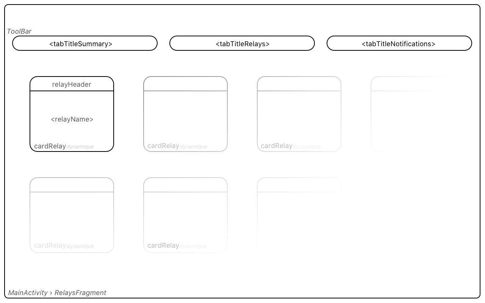
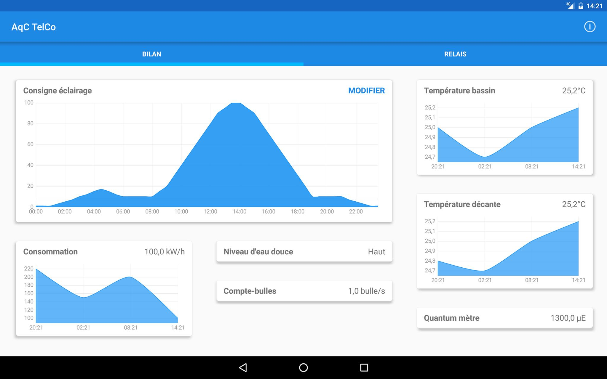
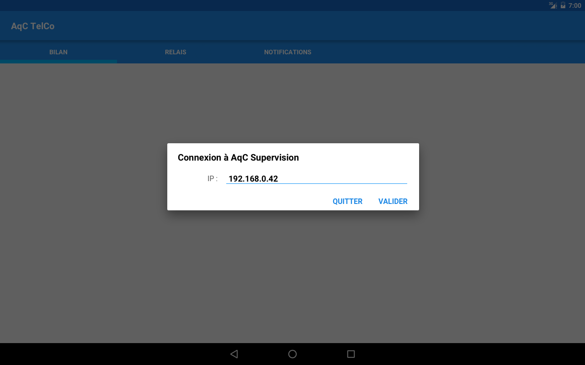
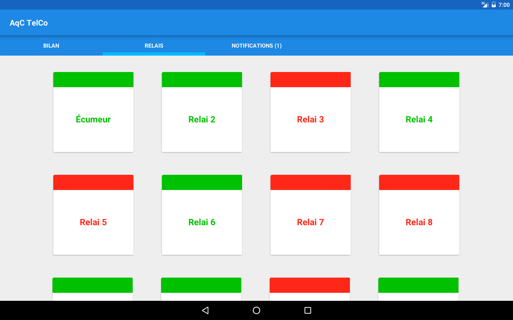
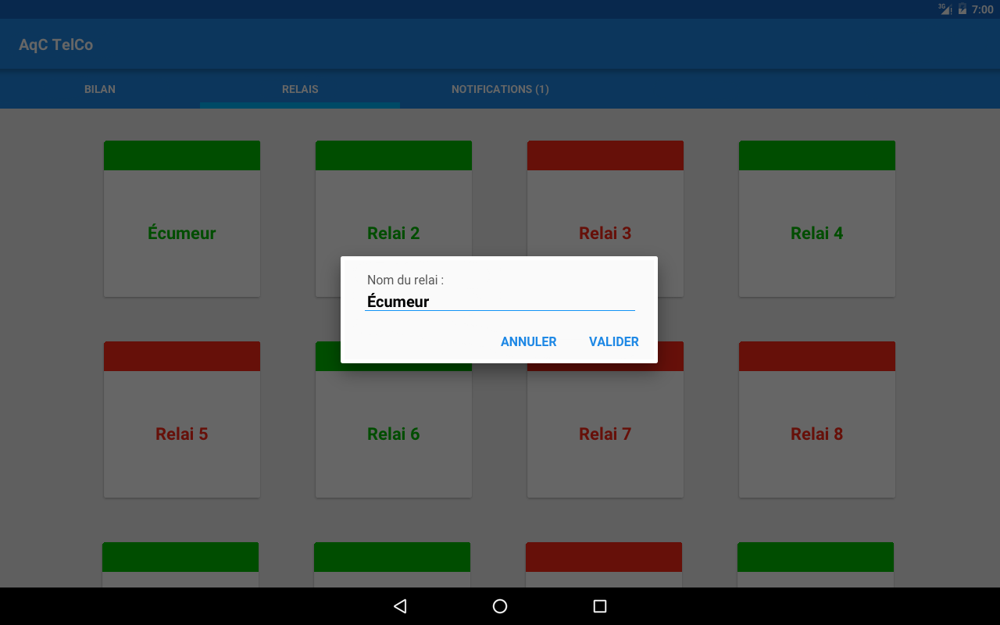
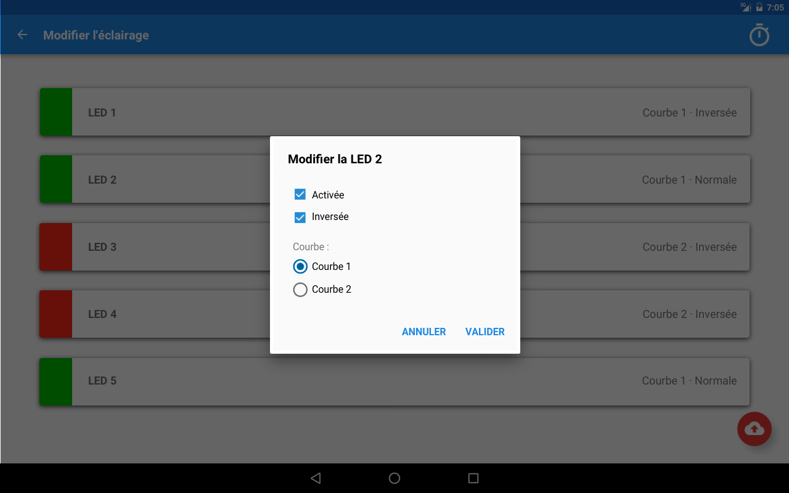

# AqC TelCo

Complete Embedded System for aquatic ecosystems automation. Android app communicating with a Raspberry Pi.

> **Team-work in Embedded Systems major in our Engineering school ESEO**

*Imported only the final commit of the team SVN repository.*

### V-model realization
Follows specification, conception, integration, testing, verification, and validation phases.

## Preview

### Real-time summary
Sensors value and history displayed on main screen.

### Connection to Raspberry server
Requires a AqC Supervision server set up.

### Relays panel
Simply tap to (des)activate.

Long press to rename.

### Lighting settings
Tap to switch, long press to change parameters.

